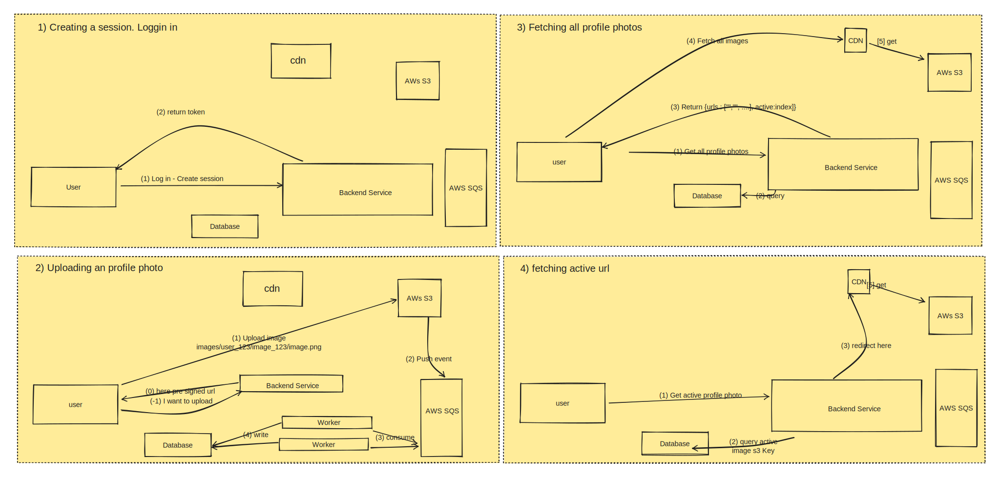

# Architecture Guide

This document outlines the core architecture, data flow, and design principles behind `onepfp`.

## Core Components



<!-- ```text
  ┌──────────────┐
  │  Client App  │◄─────────────┐
  └──────┬───────┘              │
         │ 1. Request URL       │ 3. Upload Image
         ▼                      ▼
  ┌──────────────┐       ┌──────────────┐
  │ Express API  ├──────►│  Amazon S3   │
  │   (Backend)  │ 2.    └──────┬───────┘
  └──────┬───────┘ DB           │ 4. S3 ObjectCreated
         │         Insert       ▼
         ▼               ┌──────────────┐
  ┌──────────────┐       │  Amazon SQS  │
  │  Oracle DB   │       └──────┬───────┘
  └──────────────┘              │ 5. Poll Event
                                ▼
                         ┌──────────────┐
                         │ Background   │
                         │    Worker    │
                         └──────────────┘
``` -->

1. **Express API Server (`server.cjs` / `routes/`):**
   - Handles client registration, login, JWT token issuance, and session generation.
   - Generates secure presigned S3 upload URLs using `{user_id}/{session_id}/{image_id}` as the storage key.
2. **Oracle Database:**
   - Serves as the primary data store for users, user session mappings, and upload states.
   - Tracks image upload status (`pending` initially, updated to `completed` upon successful upload).
   - Tracks the active profile picture mapping for each user in the `active` table.
3. **Amazon S3:**
   - Stores raw profile images securely. It processes direct-to-S3 uploads, avoiding load on backend nodes.
4. **Amazon SQS:**
   - Receives event notifications sent by S3 when objects are created in the bucket.
5. **Background Worker (`worker/worker.js`):**
   - Continuously polls SQS using the SDK client.
   - Upon receiving notifications, parses the S3 object key into `user_id`, `session_id`, and `image_id`, then sets the matching Oracle DB image record to `completed`.
6. **Active Image Redirection Flow:**
   - When a client requests `GET /images/:user_id`, the Express API queries the `active` table in the database and sends an HTTP `302 Redirect` to direct the client browser directly to the image object stored in S3 (or custom CDN).

---

## Concurrency & Scaling Model

- **Competing Consumers:** The worker processes can scale horizontally. Multiple instances of the worker can run concurrently.
- **Visibility Timeout:** AWS SQS manages delivery and guarantees that a message picked up by one worker process is locked and hidden from other workers, preventing duplicate processing.

---

## Design Artifacts

- [Interactive Whiteboard Diagram (Excalidraw)](../whiteboard.excalidraw)

Note: the source of truth for AWS setup steps is the [AWS S3 and SQS Setup Guide](./aws_guide.md).
